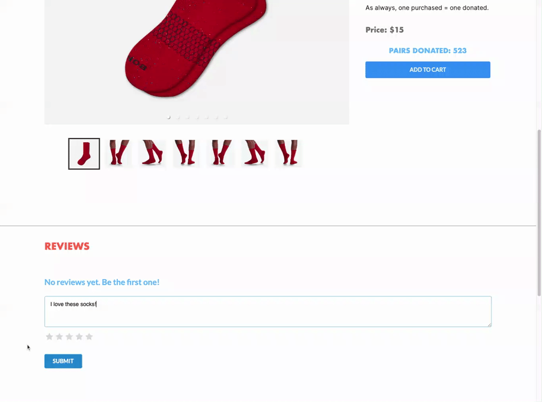
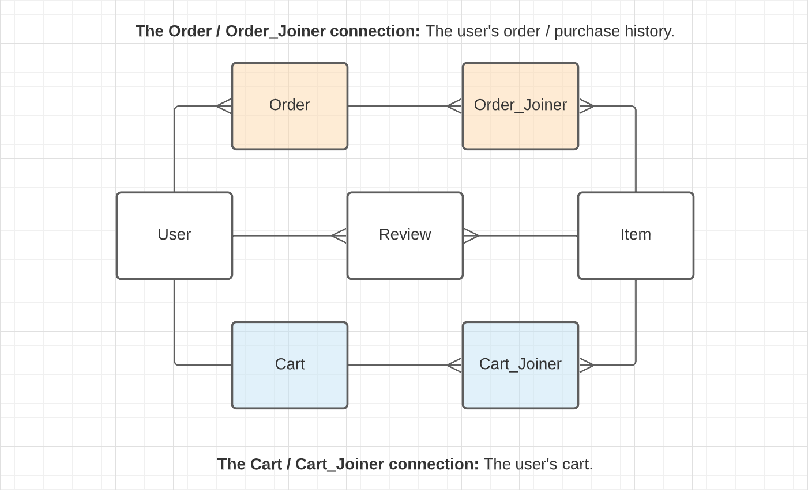
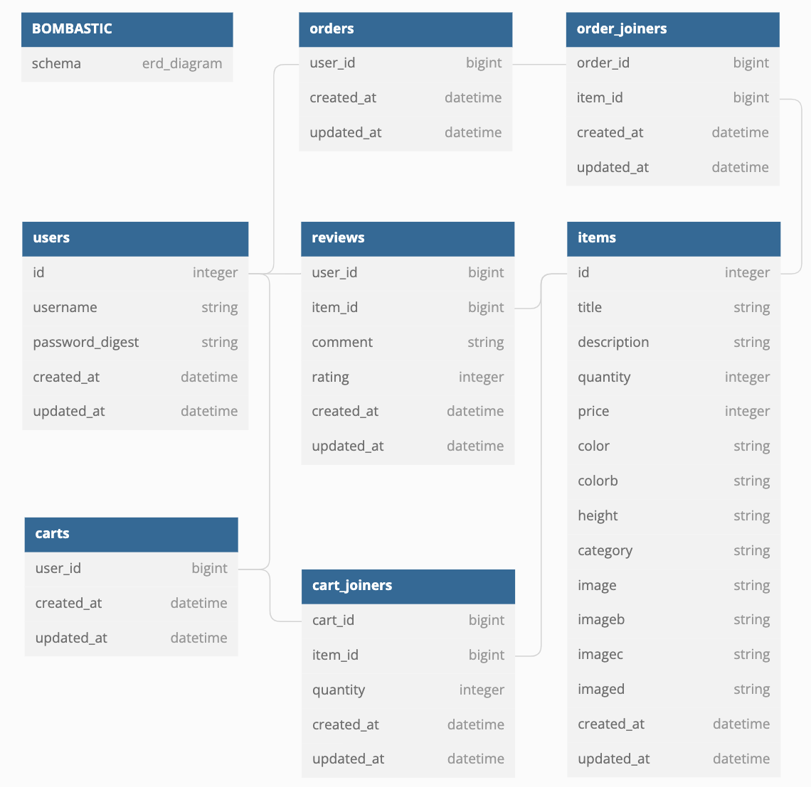

<p id="bombastic"><p>

<a href=#bombastic></a>

<a href=#bombastic></a>

#

<p id="table-of-contents"><p>

<a href=#table-of-contents></a>

-   [Background](#background)
-   [Technologies](#technologies)
-   [Prerequisites](#prerequisites)
-   [Installation](#installation)
-   [Demo & Features](#demo-and-features)
-   [ER Diagram](#er-diagram)
-   [Improvement](#improvement)
-   [Resources](#resources)
-   [Copyright](#copyright)
-   [Let's Connect!](#lets-connect)

#

<p id="background"><p>

<a href=#background></a>

-   **[Bombastic](https://youtu.be/qo_YDasFpkM)** is a mock e-commerce app inspired by the **[Bombas](https://bombas.com/)** sock apparel brand.

-   Bombas has a mission-driven, **[one purchased, one donated](https://bombas.com/pages/giving-back?campignid=1392646001&adgroupid=54889553717&targetid=kwd-300272104456&matchtype=b&network=g&device=c&keywords=%2Bbombas&creative=597211240056&gclid=CjwKCAjww8mWBhABEiwAl6-2Rf62a6fGVfHkT6iwJzB0GyxsjRgync2nfUROlT1dQ8h1NNeeoFtGzRoCsHoQAvD_BwE)** business model.

-   Bombastic implements the **[Stripe API](https://stripe.com/docs/keys)** for mock credit card purchases.

-   Bombastic was created in October and November of 2020 for my Flatiron School capstone project.

#

<p id="technologies"><p>

<a href=#technologies></a>

**Bombastic Backend: [Repo](https://github.com/emjose/bombastic-b/#bombastic)**

-   [Ruby](https://www.ruby-lang.org/en/)
-   [Rails](https://rubyonrails.org/)
-   [Stripe API](https://stripe.com/docs/api)
-   [PostgreSQL](https://www.postgresql.org/)
-   [BCrypt Gem](https://github.com/bcrypt-ruby/bcrypt-ruby)
-   [Dotenv Gem](https://github.com/bkeepers/dotenv)
-   [JSON Web Tokens](https://auth0.com/docs/secure/tokens/json-web-tokens)
-   [Active Model Serializers](https://github.com/rails-api/active_model_serializers)
-   [Cloudinary image storage](https://cloudinary.com/)

<br>

**Bombastic Frontend**

-   [React.js](https://reactjs.org/)
-   [Redux.js](https://redux.js.org/)
-   [Stripe API](https://stripe.com/docs/api)
-   [Semantic UI](https://semantic-ui.com/)
-   [React Router](https://v5.reactrouter.com/web/guides/quick-start)
-   [CSS3 Styling](https://www.tutorialrepublic.com/css-tutorial/)
-   [React Stripe Checkout](https://www.npmjs.com/package/react-stripe-checkout)
-   [React Responsive Carousel](https://www.npmjs.com/package/react-responsive-carousel)

<br>

#

<p id="prerequisites"><p>

<a href=#prerequisites></a>

<details>
<summary><b>Click to expand - Ensure you have the latest versions of the following:</b></summary>
<br>

-   **[Homebrew](https://brew.sh/)**

```console
/bin/bash -c "$(curl -fsSL https://raw.githubusercontent.com/Homebrew/install/HEAD/install.sh)"
```

-   **[Ruby](https://www.ruby-lang.org/en/)**

```console
brew install Ruby
```

-   **[Rails](https://rubyonrails.org/)**

```console
gem install Rails
```

-   **[Node.js](https://nodejs.org/en/download/)**

```console
npm install -g npm
```

-   **[PostgreSQL](https://www.postgresql.org/)**

```console
brew install postgresql
```

-   **[Google Chrome JSON formatter extension](https://chrome.google.com/webstore/detail/json-formatter/bcjindcccaagfpapjjmafapmmgkkhgoa?hl=en)**

<br>

**Create Stripe account and retrieve Stripe API key.**

-   [Stripe API Documentation](https://stripe.com/docs/keys)
-   [Using Stripe API with React and Ruby](https://medium.com/@gaidaescobar/using-stripe-api-with-react-and-ruby-b50c533a697f)

</details>

<br>

#

<p id="installation"><p>

<a href=#installation></a>

<details>
<summary><b>Click to expand - Backend Installation:</b></summary>
<br>
<br>

**[Bombastic Backend Repo](https://github.com/emjose/bombastic-b/#bombastic)**
<br>
<br>

**1. Git clone and cd into the folder.**

```console
git clone git@github.com:emjose/bombastic-b.git && cd bombastic-b
```

<br>

**2. Retrieve your [Stripe API key](https://stripe.com/docs/keys).**

-   Use the **Secret**, server-side API key.
-   The **Secret API key** has a prefix of **`sk_test`**.

<br>

**3. Create an `.env` file in the main project directory.**

```
mkdir .env
```

<br>

**4. Paste this variable in the `.env` file. Assign it the value of your Stripe Secret API key.**

```properties
STRIPE_API_KEY = "paste your Secret API key between the quotes"
```

<br>

**5. Install dependencies.**

```console
bundle install
```

<br>

**6. Create Rails database, migrations, and seed data.**

```console
rails db:create
rails db:migrate
rails db:seed
```

<br>

**7. Launch the Rails server. Best viewed on Chrome browser.**

```console
rails s -p 3000
```

<br>

**8. On Chrome browser, view the JSON database locally at http://localhost:3000/items**

<br>

**Follow all Frontend Installation steps below.**

<br>

#

</details>

<br>

<details>
<summary><b>Click to expand - Frontend Installation:</b></summary>
<br>
<br>

**Follow all Backend Installation steps above.**

<br>

**9. Git clone and cd into the folder.**

```console
git clone git@github.com:emjose/bombastic-f.git && cd bombastic-f
```

<br>

**10. Retrieve your [Stripe API key](https://stripe.com/docs/keys).**

-   Use the **Publishable**, client-side API key.
-   The **Publishable API key** has a prefix of **`pk_test`**.

<br>

**11. Create an `.env` file in the main project directory.**

```
mkdir .env
```

<br>

**12. Paste this variable in the `.env` file. Assign it the value of your Stripe Publishable API key.**

```properties
REACT_APP_STRIPE_API_KEY = "paste your Publishable API key between the quotes"
```

<br>

**13.Install dependencies.**

```console
npm install
```

<br>

**14. Launch the React app.**

```console
npm start
```

<br>

**15. Enter "y" if prompted to run on another port.**

```console
Would you like to run the app on another port instead? (Y/n)
```

</details>

<br>

#

<p id="demo-and-features"><p>

<a href=#demo-and-features></a>

**[Click for YouTube demo](https://youtu.be/qo_YDasFpkM)**

<a href="https://youtu.be/qo_YDasFpkM"></a>

<br>

<details>
<summary><b>GIF demo: Product page carousel</b></summary>
<br>

<a href="https://youtu.be/qo_YDasFpkM"></a>

<br>

</details>

<details>
<summary><b>GIF demo: Reviewing and rating products</b></summary>
<br>

<a href="https://youtu.be/qo_YDasFpkM"></a>

<br>

</details>

<details>
<summary><b>GIF demo: Modifying cart</b></summary>
<br>

<a href="https://youtu.be/qo_YDasFpkM"></a>

<br>

</details>

<details>
<summary><b>GIF demo: Checkout and order history</b></summary>
<br>

<a href="https://youtu.be/qo_YDasFpkM"></a>

<br>

</details>

#

<p id="er-diagram"><p>

<a href=#er-diagram></a>

<a href=#er-diagram></a>
<sup>© [Lucid.app](https://lucid.app/)</sup>

<a href=#er-diagram></a>

<details>
<summary>Entity-Relationship Diagram</summary>
<br>

<a href=#er-diagram></a>
<sup>© [dbdiagram.io](https://dbdiagram.io/home)</sup>

</details>

<!-- **Schema and Models**

-   View [schema](https://github.com/emjose/bombastic-b/blob/main/db/schema.rb).
-   View [models](https://github.com/emjose/bombastic-b/tree/main/app/models) or click each model below. -->

<details>
<summary>CartJoiner</summary>
<br>

```ruby
class CartJoiner < ApplicationRecord
  belongs_to :cart
  belongs_to :item
end
```

</details>

<details>
<summary>Cart</summary>
<br>

```ruby
class Cart < ApplicationRecord
  belongs_to :user
  has_many :cart_joiners, dependent: :destroy
  has_many :items, through: :cart_joiners
end
```

</details>

<details>
<summary>Item</summary>
<br>

```ruby
class Item < ApplicationRecord
    has_many :reviews, dependent: :destroy
    has_many :users, through: :reviews
    has_many :cart_joiners, dependent: :destroy
    has_many :carts, through: :cart_joiners
    has_many :order_joiners, dependent: :destroy
    has_many :orders, through: :order_joiners
end
```

</details>

<details>
<summary>OrderJoiner</summary>
<br>

```ruby
class OrderJoiner < ApplicationRecord
  belongs_to :order
  belongs_to :item
end
```

</details>

<details>
<summary>Order</summary>
<br>

```ruby
class Order < ApplicationRecord
  belongs_to :user
  has_many :order_joiners, dependent: :destroy
  has_many :items, through: :order_joiners
end
```

</details>

<details>
<summary>Review</summary>
<br>

```ruby
class Review < ApplicationRecord
  belongs_to :user
  belongs_to :item
end
```

</details>

<details>
<summary>User</summary>
<br>

```ruby
class User < ApplicationRecord
    has_secure_password

    validates :username, uniqueness: true
    has_many :reviews, dependent: :destroy
    has_many :items, through: :reviews
    has_one :cart, dependent: :destroy
    has_many :orders, dependent: :destroy
    has_many :cart_joiners, through: :orders
end
```

</details>

#

<p id="improvement"><p>

<a href=#improvement></a>

**Areas of improvement include:**

-   Enhancing my knowledge of [Semantic UI](https://semantic-ui.com/).

-   Implement full responsiveness for mobile and desktop users.

-   Applying filters for color and category.

-   Optimize web performance and accessibility.

-   Converting all images to [WebP format](https://developers.google.com/speed/webp).

-   Updating database to reflect Bombas's expanding apparel line.

-   Debug disappearing products in main component after mock purchase.

-   Possibly utilize a headless CMS to manage and scale a backend database.

-   Determine successful hosting and deployment, as heroku is egregiously slow.

#

<p id="resources"><p>

<a href=#resources></a>

-   #### [Bombas](https://bombas.com/)
-   #### [NPM](https://www.npmjs.com/)
-   #### [Lucid.app](https://lucid.app/)
-   #### [Adobe Fonts](https://fonts.adobe.com/)
-   #### [dbdiagram.io](https://dbdiagram.io/home)
-   #### [Google Fonts](https://fonts.google.com/)
-   #### [Screencastify](https://www.screencastify.com/)
-   #### [Adobe Photoshop](https://www.adobe.com/creativecloud/buy/students.html)
-   #### [Collapsible Markdown](https://michaelcurrin.github.io/dev-cheatsheets/cheatsheets/markdown/collapsible-items.html)
-   #### [My blog on how I created my Github READMEs](https://emmanueljose.medium.com/readme-a-makeover-story-b9c7be37a6de?sk=7ae6623d365409d875753e4604e42ffd)

#

<p id="copyright"><p>

<a href=#copyright></a>

-   This project is made for educational purposes only.

-   Products and product images copyright of © [Bombas](https://bombas.com/). All Rights Reserved.

#

<p id="lets-connect"><p>

<a href=#lets-connect></a>

<p><a href="https://twitter.com/Emmanuel_Labor"></a> <a href="https://www.linkedin.com/in/emmanuelpjose/"></a> <a href="https://emmanueljose.medium.com/"></a> <a href="https://www.instagram.com/emmanuel_jose/"></a> <a href="mailto:emjose@gmail.com"></a> <a href="https://www.emmanuel-jose.com/"></a> <a href="https://github.com/emjose"></a></p>

#

<a href=#bombastic></a>

<!-- # Getting Started with Create React App

This project was bootstrapped with [Create React App](https://github.com/facebook/create-react-app).

## Available Scripts

In the project directory, you can run:

### `yarn start`

Runs the app in the development mode.\
Open [http://localhost:3000](http://localhost:3000) to view it in the browser.

The page will reload if you make edits.\
You will also see any lint errors in the console.

### `yarn test`

Launches the test runner in the interactive watch mode.\
See the section about [running tests](https://facebook.github.io/create-react-app/docs/running-tests) for more information.

### `yarn build`

Builds the app for production to the `build` folder.\
It correctly bundles React in production mode and optimizes the build for the best performance.

The build is minified and the filenames include the hashes.\
Your app is ready to be deployed!

See the section about [deployment](https://facebook.github.io/create-react-app/docs/deployment) for more information.

### `yarn eject`

**Note: this is a one-way operation. Once you `eject`, you can’t go back!**

If you aren’t satisfied with the build tool and configuration choices, you can `eject` at any time. This command will remove the single build dependency from your project.

Instead, it will copy all the configuration files and the transitive dependencies (webpack, Babel, ESLint, etc) right into your project so you have full control over them. All of the commands except `eject` will still work, but they will point to the copied scripts so you can tweak them. At this point you’re on your own.

You don’t have to ever use `eject`. The curated feature set is suitable for small and middle deployments, and you shouldn’t feel obligated to use this feature. However we understand that this tool wouldn’t be useful if you couldn’t customize it when you are ready for it.

## Learn More

You can learn more in the [Create React App documentation](https://facebook.github.io/create-react-app/docs/getting-started).

To learn React, check out the [React documentation](https://reactjs.org/).

### Code Splitting

This section has moved here: [https://facebook.github.io/create-react-app/docs/code-splitting](https://facebook.github.io/create-react-app/docs/code-splitting)

### Analyzing the Bundle Size

This section has moved here: [https://facebook.github.io/create-react-app/docs/analyzing-the-bundle-size](https://facebook.github.io/create-react-app/docs/analyzing-the-bundle-size)

### Making a Progressive Web App

This section has moved here: [https://facebook.github.io/create-react-app/docs/making-a-progressive-web-app](https://facebook.github.io/create-react-app/docs/making-a-progressive-web-app)

### Advanced Configuration

This section has moved here: [https://facebook.github.io/create-react-app/docs/advanced-configuration](https://facebook.github.io/create-react-app/docs/advanced-configuration)

### Deployment

This section has moved here: [https://facebook.github.io/create-react-app/docs/deployment](https://facebook.github.io/create-react-app/docs/deployment)

### `yarn build` fails to minify

This section has moved here: [https://facebook.github.io/create-react-app/docs/troubleshooting#npm-run-build-fails-to-minify](https://facebook.github.io/create-react-app/docs/troubleshooting#npm-run-build-fails-to-minify) -->
